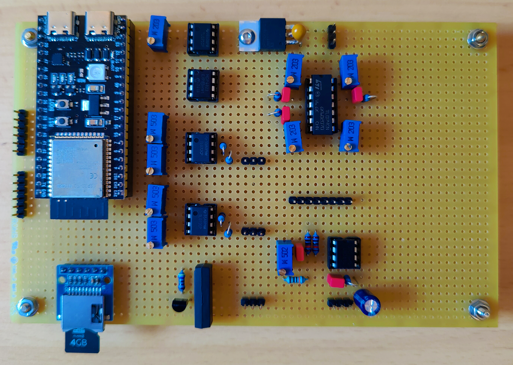
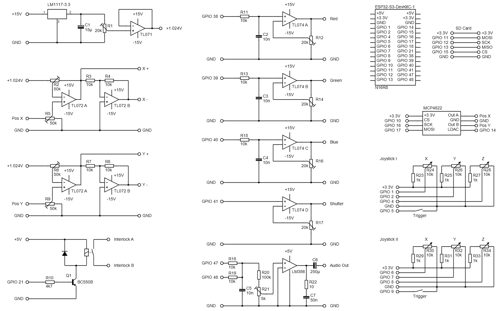

# ildaPlayer
ESP32-S3 based ILDA Player
#### Features
* plays ILDA files from SD Card
* Web UI over WiFi
#### MCP4822
* GPIO 10 - CS
* GPIO 14 - LDAC
* GPIO 16 - SCK
* GPIO 17 - MOSI
* GPIO 18 - MISO
#### Colors
* GPIO 38 - Red
* GPIO 39 - Green
* GPIO 40 - Blue
#### Shutter
* GPIO 41
#### Interlock Relais
* GPIO 21
#### SD Card
* GPIO 11 - MOSI
* GPIO 12 - SCK
* GPIO 13 - MISO
* GPIO 15 - CS
#### Joystick I
* GPIO 1 - X
* GPIO 2 - Y
* GPIO 4 - Z
* GPIO 5 - Trigger
#### Joystick II
* GPIO 6 - X
* GPIO 7 - Y
* GPIO 8 - Z
* GPIO 9 - Trigger
#### Development Hardware

#### Schematic

#### Joystick
